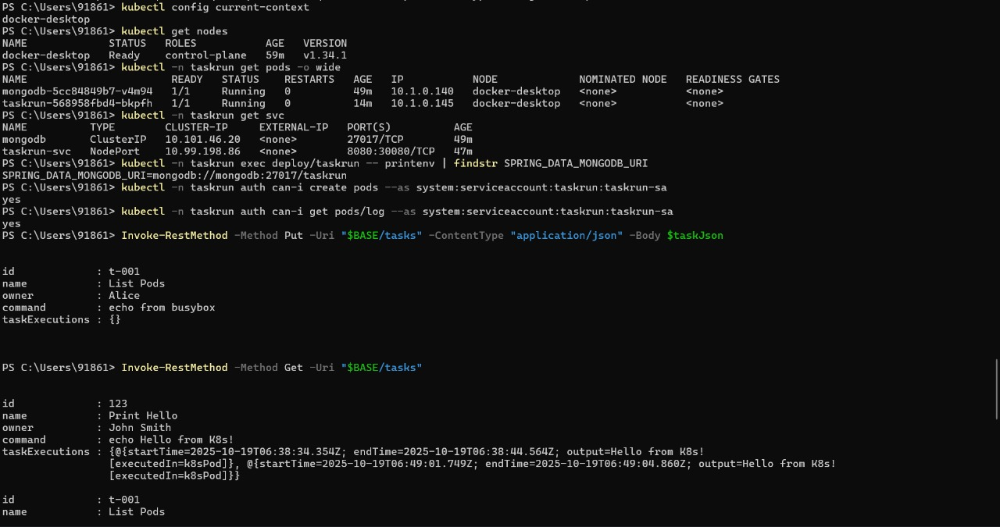
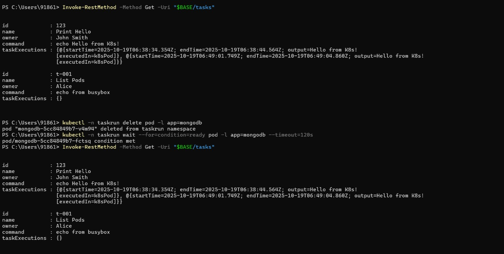
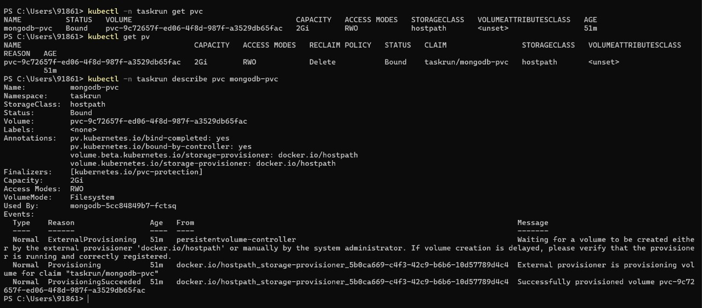
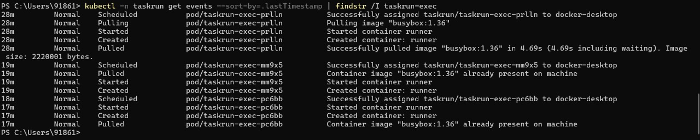

README: Kubernetes Cluster State and API Interaction

This document explains the series of commands shown in the screenshot, which detail how to inspect a Kubernetes cluster and interact with a custom task management application running within it.

Command-by-Command Explanation

kubectl config current-context

Purpose: This command displays the name of the Kubernetes context you are currently connected to. In this case, the context is docker-desktop, indicating the user is interacting with a local Kubernetes cluster provided by Docker Desktop.

kubectl get nodes

Purpose: This retrieves a list of all nodes in the cluster.

Output Analysis: It shows a single node named docker-desktop, which has the control-plane role and is in the Ready status. This confirms the cluster is operational.

kubectl -n taskrun get pods -o wide

Purpose: This command lists the pods within the taskrun namespace and provides extended information (-o wide).

Output Analysis:

mongodb-5cc...: A MongoDB database pod, running and ready (1/1). It has an internal IP address of 10.1.0.140.

taskrun-svc...: The application pod, also running and ready.

kubectl -n taskrun get svc

Purpose: This lists the Kubernetes services in the taskrun namespace. Services provide stable network endpoints for pods.

Output Analysis:

mongodb: A ClusterIP service, exposing the MongoDB pod internally on port 27017.

taskrun-svc: A NodePort service, which exposes the application on port 8080 internally and makes it accessible from outside the cluster on port 30888.

kubectl -n taskrun exec deploy/taskrun-svc -- printenv | findstr SPRING_DATA_MONGODB_URI

Purpose: This is a diagnostic command to inspect the environment variables of the running application pod.

exec deploy/taskrun-svc: Executes a command inside the container of the taskrun-svc deployment.

printenv | findstr ...: It prints all environment variables and then filters (findstr) for the line containing the MongoDB connection string (SPRING_DATA_MONGODB_URI), confirming the application is correctly configured to connect to the database.

kubectl -n taskrun auth can-i create pods --as system:serviceaccount:taskrun:taskrun-sa

Purpose: This is a Role-Based Access Control (RBAC) check. It verifies if the service account taskrun-sa has permission to create pods in the taskrun namespace.

Output Analysis: The yes output confirms the service account is correctly permissioned, which is crucial for the application to execute tasks that might involve creating new pods.

Invoke-RestMethod -Method Put -Uri "$BASE/tasks" ...

Purpose: This PowerShell command sends an HTTP PUT request to the application's API endpoint to create a new task with id "t-001".

Functionality: It demonstrates creating a resource (a task) via the application's REST API.

Invoke-RestMethod -Method Get -Uri "$BASE/tasks"

Purpose: This sends an HTTP GET request to retrieve all tasks from the application.

Output Analysis: The output shows two tasks:

One with id: 123, which was likely created previously.

ge_filename.jpg)

The new task with id: t-001 that was just created, confirming the PUT request was successful.

